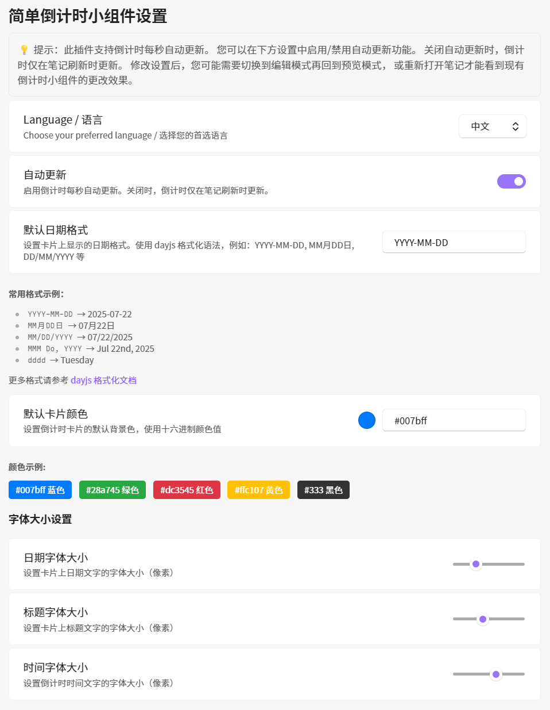

<h1 align="center">Obsidian 简单倒计时小组件</h1>

<p align="center">
中文 | <a href="README.md">English</a>
</p>
<p align="center">
  <a href="https://github.com/ZiyuZ/obsidian-simple-countdown"></a>
  <a href="https://github.com/ZiyuZ/obsidian-simple-countdown/releases"></a>
  <a href="https://github.com/ZiyuZ/obsidian-simple-countdown/releases"></a>
  <a href="https://github.com/ZiyuZ/obsidian-simple-countdown/blob/main/LICENSE"></a>
</p>

一个优雅的 Obsidian 倒计时小组件插件，为重要事件和截止日期显示精美的倒计时卡片。

<p align="center">
 
</p>

<details>
<summary>📖 JSON 格式示例</summary>

````markdown
```countdown
[
  {
    "date": "2025-12-25",
    "title": "Christmas",
    "color": "#dc3545",
    "format": "MMM Do, YYYY"
  },
  {
    "date": "2025-06-01", 
    "title": "Children's Day"
    // Uses default color and format from settings
  }
]
```

> 该插件尚未在 Obsidian 社区插件列表中提供。

<h2 align='center'>🚀 使用方法 🚀</h2>

### 基本文本格式

```countdown
{
  "date": "2025-12-25",
  "title": "Christmas",
  "color": "#dc3545",
  "format": "MMM Do, YYYY"
}
```
````

</details>

<p align="center">
 
</p>

<details>
<summary>📝 文本格式示例</summary>

````markdown
```countdown
2024-10-25 | Leaving home | #d9534f
2025-10-25 | Go home | #2c7be5
2025-07-25 | Go to Brussels | #28a745
2025-07-23T08:00 | Submit Deadline | #6f42c1 | YY-MM-DD HH:mm:ss
```
````

</details>

<h2 align='center'>✨ 功能特性 ✨</h2>

- 🎨 **可自定义卡片**：为每个倒计时设置颜色和日期格式
- ⚙️ **简易配置**：在设置中调整格式、颜色和字体大小
- 📝 **灵活输入**：支持 JSON 或简单文本格式
- 🧠 **智能时间显示**：根据剩余时间自动调整时间精度
  - **已过期事件**：显示已过去多少天
  - **7天以上**：仅显示天数
  - **1-7天**：显示天数和小时
  - **1小时-1天**：显示小时和分钟
  - **1小时以内**：显示分钟和秒
- 🔄 **自动更新**：每秒实时更新倒计时（可在设置中禁用）

> [!IMPORTANT]
> **自动更新功能**：此插件支持每秒实时倒计时更新。您可以在插件设置中控制此行为：
>
> - **自动更新开启**（默认）：倒计时每秒自动更新，提供实时显示
> - **自动更新关闭**：倒计时仅在块重新渲染时刷新（重新打开笔记、切换到编辑模式再回到预览模式，或刷新视图时）。在此模式下，倒计时数字（分钟、秒钟等）不会自动变化，直到块重新渲染

<h2 align='center'>📦 安装 📦</h2>

### 手动安装

1. 从 [GitHub Releases](https://github.com/ZiyuZ/obsidian-simple-countdown/releases) 下载最新的 `main.js` 和 `manifest.json` 文件
2. 在您知识库的 `.obsidian/plugins/` 目录中创建名为 `obsidian-simple-countdown` 的新文件夹（如果不存在）
3. 将下载的两个文件放入 `obsidian-simple-countdown` 文件夹中
4. 重新加载 Obsidian 并在第三方插件设置中启用该插件

您的文件夹结构应如下所示：

```
<您的知识库>/.obsidian/plugins/obsidian-simple-countdown/
├── main.js
├── manifest.json
└── data.json（首次使用后自动创建，用于保存您的设置）
```

### 使用 BRAT 安装

1. 从 Obsidian 社区插件安装 [BRAT 插件](https://github.com/TfTHacker/obsidian42-brat)
2. 在 Obsidian 中打开 BRAT 设置
3. 点击"添加Beta插件"并输入：`ZiyuZ/obsidian-simple-countdown`
4. 在社区插件设置中启用该插件

> [!TIP]
> 使用 BRAT 可以让您自动接收此插件的更新，即使它还未在官方社区插件列表中提供。

### 从社区安装插件

> 该插件尚未在 Obsidian 社区插件列表中提供。

## 🚀 使用方法

### 基本文本格式

```
2025-12-25 | 圣诞节 | #dc3545 | MM月DD日
2025-06-01 | 儿童节 | #28a745
2025-01-01 | 新年
# 这是注释，会被忽略
```

### JSON 格式

```json5
[
  {
    "date": "2025-12-25",
    "title": "圣诞节",
    "color": "#dc3545",
    "format": "MMM Do, YYYY"
  },
  {
    "date": "2025-06-01", 
    "title": "儿童节"
    // 使用设置中的默认颜色和格式
  }
]
```

### 创建倒计时块

只需使用 `countdown` 语言标签创建代码块：

````markdown
```countdown
2025-12-25 | 圣诞节 | #dc3545
2025-06-01 | 暑假 | #28a745
```
````

<h2 align='center'>⚙️ 配置 ⚙️</h2>

<details>
<summary>🖼️ 配置界面截图</summary>

<p align="center">
 
</p>

</details>

### 访问设置

您可以通过以下方式访问插件设置：

- `设置 → 第三方插件 → Simple Countdown Widget → 选项`
- 或使用快捷键 `Ctrl/Cmd + ,` 打开设置，然后找到该插件

### 可用设置

**语言选择**

- 在中英文界面之间切换
- 设置面板会立即更新

**默认日期格式**

- 设置卡片上显示日期的默认格式
- 使用 dayjs 格式化语法（例如：YYYY-MM-DD、MMM Do YYYY 等）

**默认卡片颜色**

- 设置倒计时卡片的默认背景色
- 使用十六进制颜色值（例如：#007bff、#28a745）

**字体大小自定义**

- **日期字体大小**：调整日期文本的字体大小（10-24px）
- **标题字体大小**：调整事件标题的字体大小（16-36px）
- **时间字体大小**：调整倒计时时间文本的字体大小（16-32px）

**自动更新设置**

- **自动更新**：启用/禁用每秒实时倒计时更新
- 启用时：倒计时自动更新以提供实时显示
- 禁用时：倒计时仅在笔记刷新或重新渲染时更新，倒计时数字（分钟、秒钟等）在此之前将保持静止

> [!TIP]
> **设置更改说明**：所有外观设置（颜色、字体大小、日期格式、语言等）在更改时会立即生效。自动更新设置仅控制倒计时数字是否每秒实时更新。

### 日期格式示例

<div align="center">

| 格式代码       | 示例输出       | 描述         |
| :------------: | :------------: | :----------: |
| `YYYY-MM-DD`   | 2025-07-22     | 标准格式     |
| `MM/DD/YYYY`   | 07/22/2025     | 美式格式     |
| `DD/MM/YYYY`   | 22/07/2025     | 欧式格式     |
| `MMM Do, YYYY` | Jul 22nd, 2025 | 英文格式     |
| `MM月DD日`     | 07月22日       | 中文格式     |
| `dddd`         | Tuesday        | 仅显示星期几 |

</div>

### 优先级

设置按以下优先级顺序应用：

1. 项目特定值（最高优先级）
2. 用户默认设置
3. 内置默认值（最低优先级）

<h2 align='center'>📖 输入格式参考 📖</h2>

### 文本格式语法

```
日期 | 标题 | 颜色(可选) | 日期格式(可选)
```

### JSON 格式架构

```typescript
interface CountdownItem {
  date: string;     // 必需：ISO 日期字符串
  title: string;    // 必需：事件标题
  color?: string;   // 可选：十六进制颜色（例如：#ff0000）
  format?: string;  // 可选：左上角日期显示格式
}
```

### 支持的日期格式

- ISO 日期：`2025-12-25`、`2025-12-25T23:59:59`
- dayjs 库支持的各种格式

### 颜色选项

使用十六进制颜色代码进行自定义颜色：

- $\color{#007bff}{\blacksquare}$ `#007bff` - 蓝色（默认）
- $\color{#28a745}{\blacksquare}$ `#28a745` - 绿色
- $\color{#dc3545}{\blacksquare}$ `#dc3545` - 红色
- $\color{#ffc107}{\blacksquare}$ `#ffc107` - 黄色
- $\color{#fd7e14}{\blacksquare}$ `#fd7e14` - 橙色
- $\color{#6f42c1}{\blacksquare}$ `#6f42c1` - 紫色

> [!TIP]
> 由于事件标题文本显示为白色，请使用较深的背景色以获得更好的可读性和对比度。

<h2 align='center'>🔧 开发 🔧</h2>

### 前置要求

- Obsidian
- bun

### 设置

```bash
# 克隆仓库
git clone https://github.com/ZiyuZ/obsidian-simple-countdown.git
cd obsidian-simple-countdown-widget

# 安装依赖
bun install

# 启动开发构建
bun run dev
```

> [!TIP]
> 如果在 Obsidian 插件目录下开发, 可能需要手动更改 `manifest.json` 的 `main` 字段为 `dist/main.js`。

### 构建

```bash
# 生产构建
bun run build
```

然后将 dist 目录中的文件复制到 `<Obsidian 知识库>/.obsidian/plugins/obsidian-simple-countdown`

### 项目结构

```
obsidian-simple-countdown/
├── src/
│   ├── main.ts                 # 主插件入口点
│   ├── settings.ts             # 插件设置和配置
│   ├── locale.ts               # 国际化支持
│   ├── constants.ts            # 常量和配置值
│   ├── types/
│   │   └── index.ts            # 类型定义
│   ├── templates/
│   │   ├── card-templates.ts   # 卡片 HTML 模板
│   │   └── alert-templates.ts  # 错误提示模板
│   ├── parsers/
│   │   └── countdown-parser.ts # 倒计时项目解析器
│   └── utils/
│       └── time-utils.ts       # 时间计算工具
├── assets/                     # 截图和图片
├── dist/                       # 构建文件
├── manifest.json               # 插件清单
├── package.json                # 依赖和脚本
├── tsconfig.json               # TypeScript 配置
├── esbuild.config.mjs          # 构建配置
└── README.md                   # 本文件
```

<h2 align='center'>📝 许可证 📝</h2>

本项目使用 MIT 许可证 - 详情请参见 [LICENSE](LICENSE) 文件。

<h2 align='center'>🙏 致谢 🙏</h2>

- 基于 [Obsidian Plugin API](https://github.com/obsidianmd/obsidian-api) 构建
- 使用 [dayjs](https://day.js.org/) 进行日期操作
- 特别感谢 [GitHub Copilot](https://github.com/features/copilot)

---

<p align="center">
<strong>祝您倒计时愉快！🎉</strong>
</p>
