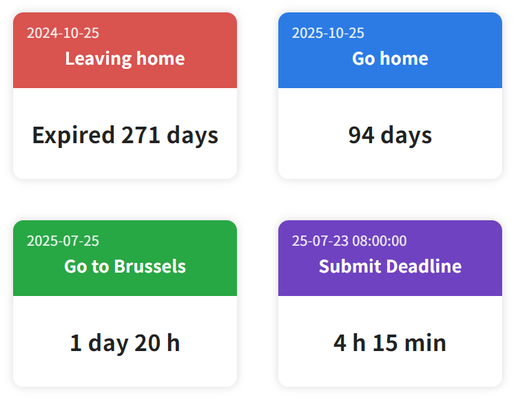

<h1 align="center">Simple Countdown Widget for Obsidian</h1>

<p align="center">
<a href="README-zh.md">中文</a> | English
</p>
<p align="center">
  <a href="https://github.com/ZiyuZ/obsidian-simple-countdown"></a>
  <a href="https://github.com/ZiyuZ/obsidian-simple-countdown/releases"></a>
  <a href="https://github.com/ZiyuZ/obsidian-simple-countdown/releases"></a>
  <a href="https://github.com/ZiyuZ/obsidian-simple-countdown/blob/main/LICENSE"></a>
</p>

An elegant countdown widget plugin for Obsidian that displays beautiful countdown cards for important events and deadlines.

<p align="center">
 
</p>

<details>
<summary>📖 JSON Format Example</summary>

````markdown
```countdown
[
  {
    "date": "2025-12-25",
    "title": "Christmas",
    "color": "#dc3545",
    "format": "MMM Do, YYYY"
  },
  {
    "date": "2025-06-01", 
    "title": "Children's Day"
    // Uses default color and format from settings
  }
]
```

> If there's only one countdown, the [] array symbols can be omitted.

```countdown
{
  "date": "2025-12-25",
  "title": "Christmas",
  "color": "#dc3545",
  "format": "MMM Do, YYYY"
}
```
````

</details>

<p align="center">
 
</p>

<details>
<summary>📝 Text Format Example</summary>

````markdown
```countdown
2024-10-25 | Leaving home | #d9534f
2025-10-25 | Go home | #2c7be5
2025-07-25 | Go to Brussels | #28a745
2025-07-23T08:00 | Submit Deadline | #6f42c1 | YY-MM-DD HH:mm:ss
```
````

</details>

<h2 align='center'>✨ Features ✨</h2>

- 🎨 **Customizable Cards**: Set colors and date formats for each countdown
- ⚙️ **Easy Configuration**: Adjust formats, colors, and font sizes in settings
- 📝 **Flexible Input**: Use either JSON or simple text
- 🧠 **Smart Time Display**: Automatically adjusts time precision based on remaining duration
  - **Past events**: Shows how many days have passed
  - **7+ days**: Shows days only for simplicity
  - **1-7 days**: Shows days and hours
  - **1 hour - 1 day**: Shows hours and minutes
  - **Under 1 hour**: Shows minutes and seconds
- 🔄 **Auto Update**: Real-time countdown updates every second (can be disabled in settings)

> [!IMPORTANT]
> **Auto Update Feature**: This plugin supports real-time countdown updates every second. You can control this behavior in the plugin settings:
>
> - **Auto Update ON** (default): Countdowns update automatically every second for real-time display
> - **Auto Update OFF**: Countdowns only refresh when the block is re-rendered (when reopening the note, switching to edit mode and back, or refreshing the view). In this mode, the countdown numbers (minutes, seconds, etc.) will not change automatically until the block is re-rendered

<h2 align='center'>📦 Installation 📦</h2>

### Manual Installation

1. Download the latest `main.js` and `manifest.json` files from [GitHub Releases](https://github.com/ZiyuZ/obsidian-simple-countdown/releases)
2. Create a new folder named `obsidian-simple-countdown` in your vault's `.obsidian/plugins/` directory (if it doesn't exist)
3. Place both downloaded files into the `obsidian-simple-countdown` folder
4. Reload Obsidian and enable the plugin in Community Plugins settings

Your folder structure should look like this:

```
<Your Vault>/.obsidian/plugins/obsidian-simple-countdown/
├── main.js
├── manifest.json
└── data.json (created automatically after first use to store your settings)
```

### Using BRAT (Beta Reviewers Auto-update Tool)

1. Install the [BRAT plugin](https://github.com/TfTHacker/obsidian42-brat) from Obsidian Community Plugins
2. Open BRAT settings in Obsidian
3. Click "Add Beta Plugin" and enter: `ZiyuZ/obsidian-simple-countdown`
4. Enable the plugin in Community Plugins settings

> [!TIP]
> Using BRAT allows you to automatically receive updates for this plugin, even before it's available in the official community plugins list.

### From Obsidian Community Plugins

> The plugin is not yet available in Obsidian community plugin list.

<h2 align='center'>🚀 Usage 🚀</h2>

### Basic Text Format

```
2025-12-25 | Christmas | #dc3545 | MM/DD
2025-06-01 | Children's Day | #28a745
2025-01-01 | New Year
# This is a comment and will be ignored
```

### JSON Format

```json5
[
  {
    "date": "2025-12-25",
    "title": "Christmas",
    "color": "#dc3545",
    "format": "MMM Do, YYYY"
  },
  {
    "date": "2025-06-01", 
    "title": "Children's Day"
    // Uses default color and format from settings
  }
]
```

### Creating a Countdown Block

Simply create a code block with the `countdown` language tag:

````markdown
```countdown
2025-12-25 | Christmas | #dc3545
2025-06-01 | Summer Holiday | #28a745
```
````

<h2 align='center'>⚙️ Configuration ⚙️</h2>

<details>
<summary>🖼️ Configuration Screenshot</summary>

<p align="center">
 
</p>

</details>

### Accessing Settings

You can access the plugin settings through:

- `Settings → Community Plugins → Simple Countdown Widget → Options`
- Or use keyboard shortcut `Ctrl/Cmd + ,` to open settings, then find the plugin

### Available Settings

**Language Selection**

- Switch between English and Chinese interface
- Settings panel will update immediately

**Default Date Format**

- Set the default format for displaying dates on cards
- Uses dayjs formatting syntax (e.g., YYYY-MM-DD, MMM Do YYYY, etc.)

**Default Card Color**

- Set the default background color for countdown cards
- Use hex color values (e.g., #007bff, #28a745)

**Font Size Customization**

- **Date Font Size**: Adjust the font size for date text (10-24px)
- **Title Font Size**: Adjust the font size for event titles (16-36px)
- **Time Font Size**: Adjust the font size for countdown time text (16-32px)

**Auto Update Settings**

- **Auto Update**: Enable/disable real-time countdown updates every second
- When enabled: Countdowns update automatically every second for real-time display
- When disabled: Countdowns only update when notes are refreshed or re-rendered, and the countdown numbers (minutes, seconds, etc.) will remain static until then

> [!TIP]
> **Settings Changes**: All appearance settings (colors, font sizes, date formats, language) are applied immediately when changed. The auto-update setting only controls whether countdown numbers update in real-time every second.

### Date Format Examples

<div align="center">

| Format Code    | Example Output | Description      |
| :------------: | :------------: | :--------------: |
| `YYYY-MM-DD`   | 2025-07-22     | Standard format  |
| `MM/DD/YYYY`   | 07/22/2025     | US format        |
| `DD/MM/YYYY`   | 22/07/2025     | EU format        |
| `MMM Do, YYYY` | Jul 22nd, 2025 | English format   |
| `MM月DD日`     | 07月22日       | Chinese format   |
| `dddd`         | Tuesday        | Day of week only |

</div>

### Priority System

Settings are applied in the following priority order:

1. Item-specific values (highest priority)
2. User default settings
3. Built-in default values (lowest priority)

<h2 align='center'>📖 Input Format Reference 📖</h2>

### Text Format Syntax

```
date | title | color(optional) | date format(optional)
```

### JSON Format Schema

```typescript
interface CountdownItem {
  date: string;     // Required: ISO date string
  title: string;    // Required: Event title
  color?: string;   // Optional: Hex color (e.g., #ff0000)
  format?: string;  // Optional: Date format in the upper left corner
}
```

### Supported Date Formats

- ISO dates: `2025-12-25`, `2025-12-25T23:59:59`
- Various formats supported by dayjs library

### Color Options

Use hex color codes for custom colors:

- $\color{#007bff}{\blacksquare}$ `#007bff` - Blue (default)
- $\color{#28a745}{\blacksquare}$ `#28a745` - Green  
- $\color{#dc3545}{\blacksquare}$ `#dc3545` - Red
- $\color{#ffc107}{\blacksquare}$ `#ffc107` - Yellow
- $\color{#fd7e14}{\blacksquare}$ `#fd7e14` - Orange
- $\color{#6f42c1}{\blacksquare}$ `#6f42c1` - Purple

> [!TIP]
> Since the event title text is displayed in white, please use darker background colors for better readability and contrast.

<h2 align='center'>🔧 Development 🔧</h2>

### Prerequisites

- Obsidian
- bun

### Setup

```bash
# Clone the repository
git clone https://github.com/ZiyuZ/obsidian-simple-countdown.git
cd obsidian-simple-countdown-widget

# Install dependencies
bun install

# Start development build
bun run dev
```

>[!TIP]
> If developing in the Obsidian plugin directory, you might need to manually change the `main` field in `manifest.json` to `dist/main.js`.

### Building

```bash
# Build for production
bun run build
```

Then copy the file in the dist directory to `<Obsidian Vault>/.obsidian/plugins/obsidian-simple-countdown`

### Project Structure

```
obsidian-simple-countdown/
├── src/
│   ├── main.ts                 # Main plugin entry point
│   ├── settings.ts             # Plugin settings and configuration
│   ├── locale.ts               # Internationalization support
│   ├── constants.ts            # Constants and configuration values
│   ├── types/
│   │   └── index.ts            # Type definitions
│   ├── templates/
│   │   ├── card-templates.ts   # Card HTML templates
│   │   └── alert-templates.ts  # Error alert templates
│   ├── parsers/
│   │   └── countdown-parser.ts # Countdown items parser
│   └── utils/
│       └── time-utils.ts       # Time calculation utilities
├── assets/                     # Screenshots and images
├── dist/                       # Built files
├── manifest.json               # Plugin manifest
├── package.json                # Dependencies and scripts
├── tsconfig.json               # TypeScript configuration
├── esbuild.config.mjs          # Build configuration
└── README.md                   # This file
```

<h2 align='center'>📝 License 📝</h2>

This project is licensed under the MIT License - see the [LICENSE](LICENSE) file for details.

<h2 align='center'>🙏 Acknowledgments 🙏</h2>

- Built with [Obsidian Plugin API](https://github.com/obsidianmd/obsidian-api)
- Uses [dayjs](https://day.js.org/) for date manipulation
- Special thanks to [GitHub Copilot](https://github.com/features/copilot)

---

<p align="center">
<strong>Happy counting down! 🎉</strong>
</p>
